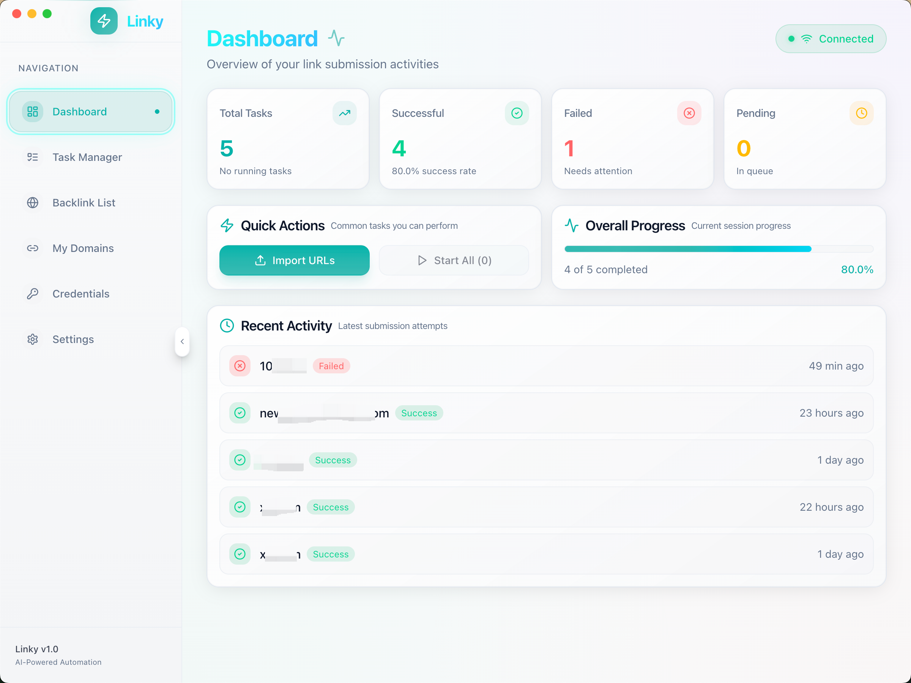
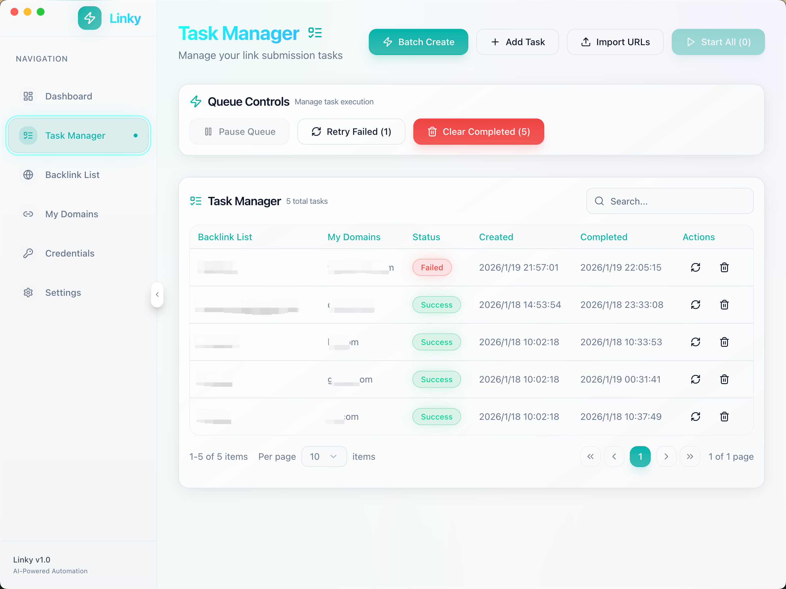
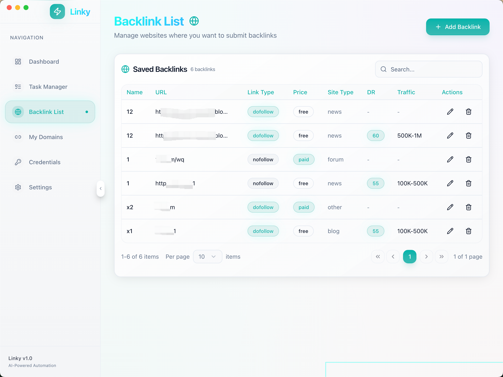
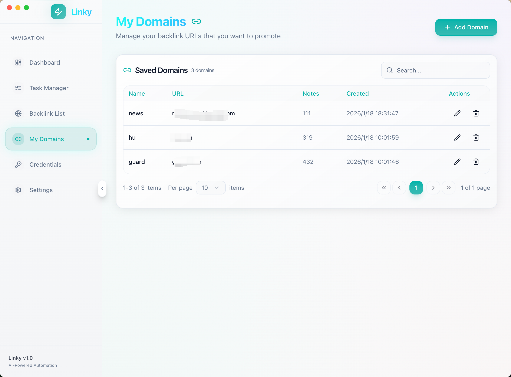
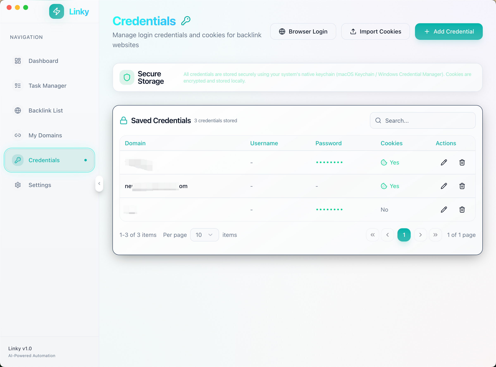

# 🔗 Linky

**AI-Powered Smart Link Submission Tool**

[English](./README.md)

---

## 🚧 Project Status

> **⚠️ This project is currently under active development.**
>
> We're working hard to bring you a powerful AI-powered link submission tool. Your support means everything to us!
>
> - ⭐ **Star this repo** to show your interest and help us gauge demand
> - 💡 **Submit ideas** via [Issues](../../issues) - we'd love to hear your suggestions
> - 🚀 **Early access** - Want to be among the first to try Linky? See [Early Access](#-early-access) below

---

## 🎯 What is Linky?

Linky is a desktop application that uses **AI-powered browser automation** to help you submit backlinks to websites intelligently. Unlike traditional SEO tools with fixed site lists, Linky can adapt to **any website** you provide.

### Why Linky?

| Traditional Tools | Linky |
|-------------------|-------|
| Fixed website lists (500-2000 sites) | **Any website you want** |
| Breaks when sites update | **AI auto-adapts** |
| Robotic patterns, easy to detect | **Human-like behavior** |
| Steep learning curve | **Simple, intuitive UI** |
| Hidden costs | **BYOK - Full cost transparency** |

---

## ✨ Features

- 🤖 **AI-Powered Automation** - Uses browser-use + Claude/OpenAI for intelligent browser control
- 🎬 **Action Replay** - Records successful submissions for zero-cost replay (no AI needed for repeat sites)
- 🔐 **Secure Storage** - Credentials stored in OS keychain (macOS Keychain / Windows Credential Manager)
- 📊 **Real-time Dashboard** - Monitor progress, success rates, and costs
- 💰 **BYOK (Bring Your Own Key)** - Use your own Claude/OpenAI API key, full cost transparency
- 🌐 **Hybrid Mode** - Smart switching between scripts and AI to minimize costs

---

## 🖥️ Screenshots

Click to expand screenshots

| Task Manager | Backlink List |
|-----------|-----------------|
|  |  |

| My Domains | Credentials |
|-----------|-----------------|
|  |  |

---

## 🛠️ Tech Stack

### Frontend (Electron)
- Electron + electron-vite
- React 19 + TypeScript
- Tailwind CSS 4 + Shadcn UI
- Zustand (state management)

### Backend (Python Sidecar)
- FastAPI + Uvicorn
- browser-use (AI browser automation)
- Playwright (browser control)
- keyring (OS keychain integration)

---

## 🗺️ Roadmap

### ✅ Completed Features

**Dashboard & Monitoring**
- [x] Real-time task statistics (total, success, failed, pending)
- [x] Success rate tracking and progress visualization
- [x] Recent activity timeline
- [x] Backend connection status indicator
- [x] Quick actions for common operations

**Task Management**
- [x] Single task creation with target URL and backlink URL
- [x] Batch task creation (Target Sites × My Domains matrix)
- [x] CSV/Excel import with template download
- [x] Task queue controls (start all, retry failed, clear completed)
- [x] Task search and pagination
- [x] Real-time task status updates

**Target Sites Library**
- [x] Manage external sites for link submission
- [x] Rich metadata: link type (dofollow/nofollow), price, site type
- [x] Domain authority (DR) and traffic estimation
- [x] Search, filter, and pagination

**My Domains (Backlink Sources)**
- [x] Manage your own websites/pages to promote
- [x] AI-powered site info fetching (auto-fill name, description, keywords)
- [x] Image upload and management
- [x] Rich metadata: category, language, social links
- [x] Custom fields support

**Credential Management**
- [x] Secure storage using OS Keychain (macOS) / Credential Manager (Windows)
- [x] Username/password credential storage
- [x] Cookie import from JSON files
- [x] Browser login capture (launch browser → login → capture cookies)
- [x] Search and pagination

**Settings & Configuration**
- [x] Multi-LLM configuration (Claude, OpenAI, DeepSeek, Moonshot, GLM, MinMax etc.)
- [x] Custom API base URL for proxies
- [x] Headless mode toggle
- [x] Concurrent task limit configuration
- [x] Retry count and delay settings
- [x] Dark/Light theme switching
- [x] Multi-language support
- [x] Task completion notifications

**Technical Foundation**
- [x] Electron + React 19 desktop app
- [x] Python FastAPI backend (sidecar)
- [x] Playwright browser automation
- [x] browser-use AI agent integration
- [x] WebSocket real-time updates
- [x] Zustand state management

### 🚧 In Progress

- [ ] Windows packaging and testing
- [ ] Proxy configuration
- [ ] Action replay system (record & replay successful submissions)

### 📋 Planned Features

- [ ] Multi-account rotation per site
- [ ] Detailed logs with screenshots
- [ ] Cost tracking and analytics
- [ ] Community script sharing
- [ ] Pre-built website templates library
- [ ] Scheduled task execution

---

## 🌟 Early Access

**Want to be among the first to try Linky?**

We're looking for early adopters who can provide feedback and help shape the product. If you're interested:

1. **Open an Issue** - Create an issue with the title `[Early Access Request]` and leave your contact info
2. **Tweet us** - Send a DM or mention [@yebooai](https://x.com/yebooai) on Twitter/X
3. **Star & Watch** - Star this repo and click "Watch" to get notified when we release

Early adopters will get:
- 🎁 Free access during beta period
- 🗣️ Direct line to the development team
- 🏆 Special recognition as founding users

---

## 💡 Feature Requests & Feedback

We're building Linky for YOU! Your feedback is incredibly valuable.

**Have an idea or suggestion?**
- Open an [Issue](../../issues) with the `enhancement` label
- Describe your use case - the more detail, the better!
- Vote on existing feature requests with 👍

**Found a bug?**
- Open an [Issue](../../issues) with the `bug` label
- Include steps to reproduce if possible

---

## ⭐ Support This Project

If you find this project interesting or useful, please consider giving it a **star**!

Stars help us:
- 📊 Understand community interest
- 💪 Stay motivated to keep developing
- 📢 Gain visibility for more contributors

Every star counts and is deeply appreciated! 🙏

---

## ⚠️ Disclaimer

This tool is provided for **educational and research purposes**. Users are responsible for:
- Complying with target websites' Terms of Service
- Using the tool ethically and legally
- Any consequences of automated submissions

The developers are not liable for any misuse of this software.

---

## 📄 License

MIT License - see [LICENSE](LICENSE) for details.

---

### 🔗 Connect With Us

**Twitter/X:** [@yebooai](https://x.com/yebooai)

---

**If you like this project, please ⭐ star it!**

Your support keeps us going!

Made with ❤️ by the Linky Team

